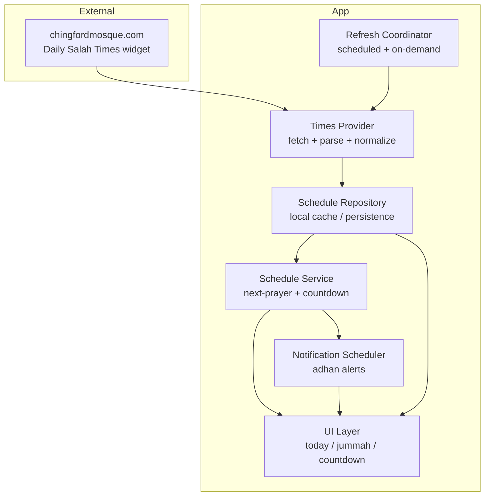
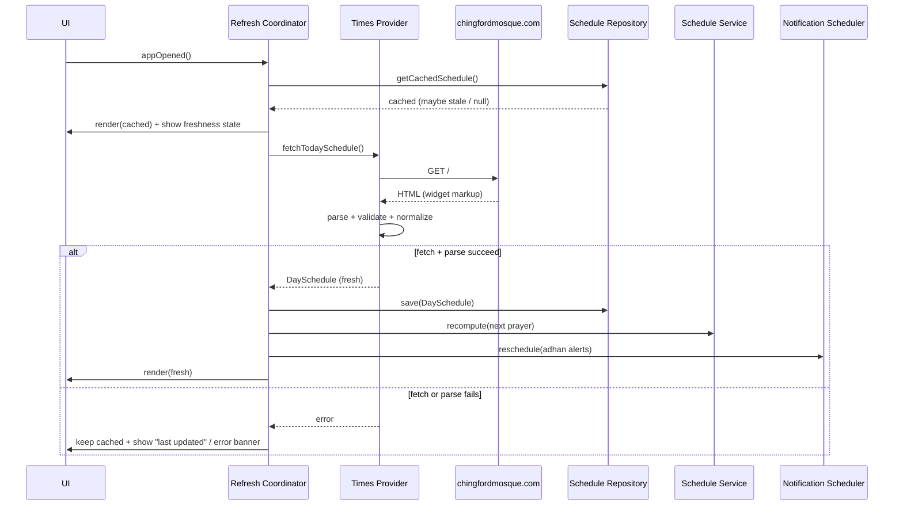
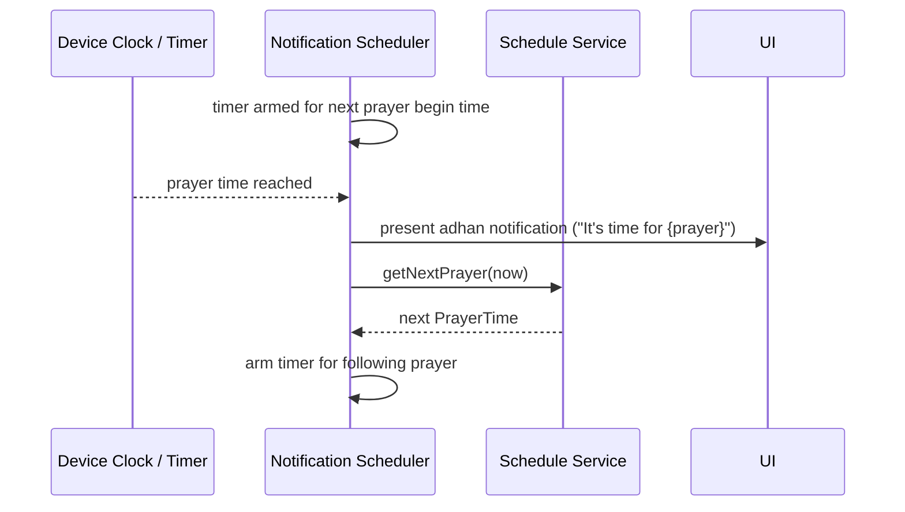

# Design Document: Prayer Times App (Chingford Mosque)

## Overview

The Prayer Times App is a client application that fetches up-to-date salah (prayer)
times and Jummah (Friday) jamā'ah times from the Chingford Mosque website
(https://chingfordmosque.com/), determines the next upcoming prayer, and raises an
azaan/adhan notification when a prayer time arrives. The app keeps a local cache so it
can continue to display the most recently known times when the device is offline, and
it refreshes data on a schedule and on demand.

The mosque publishes its data through a "Daily Salah Times" widget that exposes, for the
current day, a table of prayers with two columns of interest — **Begins** (the
astronomical/adhan time) and **Iqamah** (the congregational jamā'ah time) — for Fajr,
Sunrise (begins only), Zuhr, Asr, Maghrib, and Isha, plus a "Jummah Timing" line listing
the 1st/2nd/3rd Friday jamā'ah times. Because the source is a rendered web widget rather
than a documented JSON API, the design isolates all source-specific parsing behind a
single **Times Provider** boundary so that the rest of the system depends only on a clean,
validated domain model. This keeps the app resilient if the website's markup changes —
only the provider/adapter needs updating.

The high-level approach: a **Times Provider** retrieves and normalizes the raw schedule;
a **Cache/Repository** persists the latest known schedule; a **Schedule Service** computes
the "next prayer" and the countdown; a **Notification Scheduler** arms an adhan alert for
each upcoming prayer time; and a **UI layer** presents today's times, Jummah times, and the
next-prayer countdown.

## Architecture



**Layering and dependency direction**
- The UI, Schedule Service, and Notification Scheduler depend only on the domain model
  (`DaySchedule`, `Prayer`, `PrayerTime`), never on the website's markup.
- Only the **Times Provider** knows how to talk to chingfordmosque.com and how to parse
  its widget. All source-specific fragility is confined here.
- The **Schedule Repository** is the single source of truth the UI renders from, so the
  app always has something to show (last known good data) even when a fetch fails.

## Sequence Diagrams

### Flow 1: App launch / refresh



### Flow 2: Adhan notification firing



## Components and Interfaces

### Component 1: Times Provider

**Purpose**: Fetch the raw schedule from chingfordmosque.com and convert it into a
validated `DaySchedule` domain object. This is the only component that knows the website's
structure (HTML/widget shape, field labels, time formats).

**Interface**:
```pascal
INTERFACE TimesProvider
  // Fetches and parses today's schedule from the remote source.
  // May raise FetchError (network) or ParseError (unexpected markup / invalid data).
  FUNCTION fetchTodaySchedule() RETURNS Result<DaySchedule, ProviderError>
END INTERFACE
```

**Responsibilities**:
- Perform the HTTP request to the mosque site.
- Locate and parse the "Daily Salah Times" widget and "Jummah Timing" line.
- Normalize times into a canonical 24-hour internal representation.
- Validate completeness/ordering and surface a typed error when data is missing or malformed.

### Component 2: Schedule Repository (Cache)

**Purpose**: Persist the most recent successfully fetched `DaySchedule` and metadata
(`fetchedAt`, `scheduleDate`) so the app can render last-known-good data offline.

**Interface**:
```pascal
INTERFACE ScheduleRepository
  FUNCTION save(schedule: DaySchedule) RETURNS Void
  FUNCTION getCachedSchedule() RETURNS Option<CachedSchedule>
  FUNCTION clear() RETURNS Void
END INTERFACE
```

**Responsibilities**:
- Atomically store the latest schedule plus the timestamp it was fetched.
- Return cached data with enough metadata for the UI to display freshness ("Last updated…").
- Never overwrite good data with an empty/invalid schedule.

### Component 3: Schedule Service

**Purpose**: Pure domain logic over a `DaySchedule`: determine the next upcoming prayer
relative to "now" and compute the countdown.

**Interface**:
```pascal
INTERFACE ScheduleService
  // Returns the next prayer at or after `now`. If all of today's prayers have passed,
  // returns the next day's first prayer when available, else None.
  FUNCTION getNextPrayer(schedule: DaySchedule, now: DateTime) RETURNS Option<PrayerTime>

  // Time remaining until the next prayer begins.
  FUNCTION timeUntilNext(schedule: DaySchedule, now: DateTime) RETURNS Option<Duration>

  // Ordered list of today's prayers used for display.
  FUNCTION orderedPrayers(schedule: DaySchedule) RETURNS List<PrayerTime>
END INTERFACE
```

**Responsibilities**:
- Compute "next prayer" deterministically from prayer **begin** times.
- Exclude Sunrise from "prayer" alerting (it is informational, not a salah) while still
  exposing it for display.
- Contain no I/O, no clock side effects (current time is passed in).

### Component 4: Notification Scheduler

**Purpose**: Arm a device notification ("azaan/adhan") for each upcoming prayer begin time
and re-arm after each fires or whenever the schedule changes.

**Interface**:
```pascal
INTERFACE NotificationScheduler
  // (Re)schedule adhan notifications for all remaining prayers in the schedule.
  FUNCTION reschedule(schedule: DaySchedule, now: DateTime) RETURNS Void

  // Cancel all pending adhan notifications.
  FUNCTION cancelAll() RETURNS Void

  // User preference: which prayers should notify, and whether sound/adhan plays.
  FUNCTION setPreferences(prefs: NotificationPreferences) RETURNS Void
END INTERFACE
```

**Responsibilities**:
- Translate each upcoming prayer begin time into a scheduled local notification.
- Respect user preferences (per-prayer enable/disable, sound on/off).
- Cancel and re-arm notifications when the schedule is refreshed to avoid stale/duplicate alerts.

### Component 5: Refresh Coordinator

**Purpose**: Orchestrate when to fetch (on launch, on a daily boundary, on manual pull-to-refresh)
and wire provider → repository → service → scheduler → UI.

**Interface**:
```pascal
INTERFACE RefreshCoordinator
  FUNCTION refreshNow() RETURNS Result<DaySchedule, ProviderError>
  FUNCTION onAppOpened() RETURNS Void
  FUNCTION scheduleDailyRefresh() RETURNS Void
END INTERFACE
```

**Responsibilities**:
- Always render cached data first, then update on a successful fetch.
- Trigger a refresh at the start of a new day so times roll over.
- Degrade gracefully: a failed fetch leaves cached data intact.

## Data Models

### Model 1: Prayer (enumeration)

```pascal
ENUM Prayer
  Fajr
  Sunrise      // informational only; not an alerting salah
  Zuhr
  Asr
  Maghrib
  Isha
END ENUM
```

### Model 2: PrayerTime

```pascal
STRUCTURE PrayerTime
  prayer:      Prayer
  beginsAt:    Time        // 24h canonical begin/adhan time
  iqamahAt:    Option<Time> // congregational time; absent for Sunrise
END STRUCTURE
```

**Validation Rules**:
- `beginsAt` MUST be a valid time of day (00:00–23:59).
- If present, `iqamahAt` MUST be greater than or equal to `beginsAt`.
- Sunrise MUST NOT carry an `iqamahAt`.

### Model 3: JummahTimes

```pascal
STRUCTURE JummahTimes
  jamaahTimes: List<Time>   // e.g. [13:20, 14:00, 14:30] for 1st/2nd/3rd jamā'ah
END STRUCTURE
```

**Validation Rules**:
- `jamaahTimes` MUST contain at least one entry when Jummah data is available.
- Entries SHOULD be in ascending chronological order.

### Model 4: DaySchedule

```pascal
STRUCTURE DaySchedule
  scheduleDate: Date
  prayers:      List<PrayerTime>   // Fajr, Sunrise, Zuhr, Asr, Maghrib, Isha
  jummah:       Option<JummahTimes> // present/relevant on Fridays
END STRUCTURE
```

**Validation Rules**:
- MUST contain the five daily salah (Fajr, Zuhr, Asr, Maghrib, Isha); Sunrise optional but expected.
- Prayer **begin** times MUST be strictly increasing in canonical order
  (Fajr < Sunrise < Zuhr < Asr < Maghrib < Isha).
- `scheduleDate` MUST be the date the times apply to.

### Model 5: CachedSchedule

```pascal
STRUCTURE CachedSchedule
  schedule:  DaySchedule
  fetchedAt: DateTime   // when this data was successfully retrieved
END STRUCTURE
```

### Model 6: NotificationPreferences

```pascal
STRUCTURE NotificationPreferences
  enabledPrayers: Set<Prayer>   // which prayers fire an adhan alert
  playAdhanSound: Boolean       // play adhan audio vs. silent/standard notification
END STRUCTURE
```

### Supporting types

```pascal
TYPE Result<T, E> = Ok(value: T) | Err(error: E)
TYPE Option<T>    = Some(value: T) | None

ENUM ProviderError
  NetworkError(detail: String)    // could not reach the site
  ParseError(detail: String)      // markup/format not as expected
  IncompleteData(detail: String)  // required prayers missing/invalid
END ENUM
```

## Correctness Properties

These properties hold for all valid inputs and guide both implementation and testing.

1. **Next-prayer correctness**: For any `DaySchedule s` and time `now`, `getNextPrayer(s, now)`
   returns the prayer with the smallest `beginsAt` strictly greater than `now` among alerting
   prayers; if none remain today, it returns None (or the next day's first prayer when available).
2. **Monotonic ordering**: For any successfully parsed `DaySchedule`, the alerting prayers'
   begin times are strictly increasing.
3. **Iqamah not before begin**: For every `PrayerTime`, `iqamahAt`, when present, is `>= beginsAt`.
4. **Cache safety**: A failed fetch never replaces a previously cached valid `DaySchedule`.
5. **No duplicate alerts**: After `reschedule`, at most one pending notification exists per
   (prayer, date); re-running refresh does not create duplicates.
6. **Sunrise is non-alerting**: Sunrise is never returned by `getNextPrayer` and never schedules a notification.
7. **Freshness visibility**: Whenever displayed data is older than one day or came from cache
   after a failed refresh, the UI exposes a "last updated" / stale indicator.

## Error Handling

### Error Scenario 1: Network unavailable / site unreachable
**Condition**: The HTTP request to chingfordmosque.com fails or times out.
**Response**: Provider returns `NetworkError`; Refresh Coordinator keeps the cached schedule.
**Recovery**: UI shows cached times with a "couldn't update — showing last known times" banner
and a retry affordance; automatic retry on next refresh trigger.

### Error Scenario 2: Markup changed / parse failure
**Condition**: The widget structure or time format differs from what the parser expects.
**Response**: Provider returns `ParseError` with detail; no cache overwrite.
**Recovery**: Keep cached data, surface a non-blocking error, and log enough detail to update
the parser adapter. Only the Times Provider needs changing.

### Error Scenario 3: Incomplete / invalid data
**Condition**: A required prayer is missing, or begin times are not strictly increasing.
**Response**: Provider returns `IncompleteData`; validation rejects the schedule.
**Recovery**: Retain last valid cached schedule; do not schedule notifications from invalid data.

### Error Scenario 4: Notification permission denied
**Condition**: The OS has not granted notification permission.
**Response**: App still displays times and countdown; adhan alerts are disabled.
**Recovery**: Prompt the user (once) to enable notifications, with guidance to system settings.

### Error Scenario 5: Day rollover while app is open
**Condition**: Midnight passes while the app is running; today's schedule is now yesterday's.
**Response**: Refresh Coordinator detects the date change and triggers a refresh.
**Recovery**: Reschedule notifications for the new day's prayers.

## Testing Strategy

### Unit Testing Approach
- **Schedule Service**: table-driven tests for `getNextPrayer` / `timeUntilNext` across
  boundaries (before Fajr, exactly at a begin time, between prayers, after Isha, Sunrise skipped).
- **Times Provider parsing**: feed recorded HTML fixtures (including the observed widget format:
  Fajr begins/iqamah, Sunrise begins-only, Zuhr/Asr/Maghrib/Isha, and the "Jummah Timing"
  line) and assert the normalized `DaySchedule`. Include malformed fixtures for error paths.
- **Repository**: save/get round-trip, and the cache-safety rule that invalid data never overwrites good data.

### Property-Based Testing Approach
Use property-based testing to validate the correctness properties above for randomly
generated valid and invalid schedules and arbitrary `now` values:
- next-prayer is always the minimal future alerting begin time,
- ordering and iqamah-not-before-begin invariants,
- failed fetch never degrades the cache.

**Property Test Library**: choose per implementation language (e.g., fast-check for
JavaScript/TypeScript, Hypothesis for Python, QuickCheck for Haskell).

### Integration Testing Approach
- End-to-end refresh against a stubbed HTTP layer returning recorded mosque responses.
- Notification scheduling integration: assert one armed alert per remaining alerting prayer
  and correct re-arming after a refresh.

## Performance Considerations
- The dataset is tiny (one day of times); fetch + parse should complete in well under a second.
- Cache reads must be instant so the UI renders immediately on launch (render cache first,
  update after fetch).
- Avoid polling the network; refresh on launch, on a daily boundary, and on manual request.
- Countdown updates use a lightweight local timer (per-second tick) without re-fetching.

## Security Considerations
- All requests to chingfordmosque.com MUST use HTTPS.
- Treat fetched HTML as untrusted input: parse defensively, never execute fetched content,
  and validate all parsed values before use.
- Store only non-sensitive schedule data locally; no personal data is collected.
- Request the minimum OS permissions required (notifications only).

## Dependencies
- **Data source**: https://chingfordmosque.com/ "Daily Salah Times" widget and "Jummah Timing"
  line (also referenced by the site's "Salah Time" / "Live Azaan" pages).
- **HTTP client**: for fetching the page (platform-standard).
- **HTML/widget parser**: to extract the schedule (the source-specific adapter).
- **Local persistence**: key-value or lightweight store for the cached `DaySchedule`.
- **Local notifications**: OS notification scheduling for adhan alerts.
- **Optional adhan audio asset**: bundled sound played when `playAdhanSound` is enabled.

> Note: The mosque widget is rendered HTML rather than a documented JSON API, so the parsing
> adapter inside the Times Provider is the primary maintenance point if the site's markup changes.
